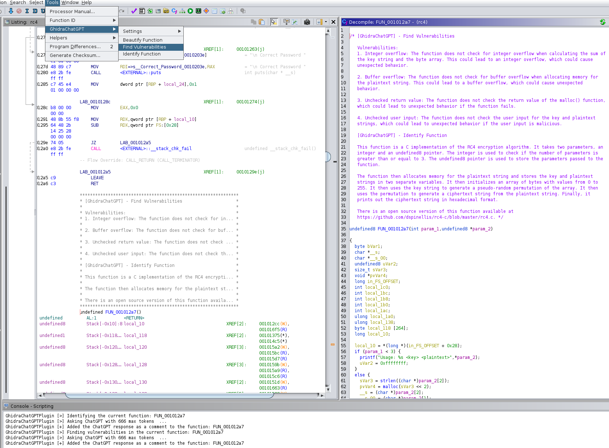

# GhidraChatGPT
A plugin that brings the power of ChatGPT to Ghidra! 

## Installation
The plugin is available as a [release](https://github.com/likvidera/GhidraChatGPT/releases) and you can build it locally by cloning this repository.

### Release
1. Download the latest release from this repository. The release version must match your Ghidra version.
2. Copy or move the archive to the `GHIDRA_INSTALL_DIR/Extensions/Ghidra` directory
3. In the Project window of Ghidra: File > Install Extension > Enable the GhidraChatGPT extension
4. Restart Ghidra
5. In the CodeBrowser window of Ghidra: File > Configure > Plugin icon in the top right > Enable the GhidraChatGPT plugin

### Build
The plugin can be built with or without docker. If it is built without docker then you need to manually resolve the dependencies such as gradle and java. The plugin is automatically added to the Ghidra Extension directory in both cases.

1. Clone this repository
2. Set the `GHIDRA_INSTALL_DIR` environment variable e.g. `export GHIDRA_INSTALL_DIR=YOUR_GHIDRA_INSTALL_DIR`
3. Build using docker: `./build.sh -d` or without: `./build.sh`
4. In the Project window of Ghidra: File > Install Extension > Enable the GhidraChatGPT extension
5. Restart Ghidra
6. In the CodeBrowser window of Ghidra: File > Configure > Plugin icon in the top right > Enable the GhidraChatGPT plugin

## Usage
The plugin's features and settings can be accessed via the `Tools` menu in the Ghidra CodeBrowser window.

### Options
The following options can be set via environment variables or via the settings in the `Tools` menu:

* `OPENAI_TOKEN`: set this to your OpenAI token e.g. `export OPENAI_TOKEN=YOUR_OPENAI_TOKEN` or the plugin will ask for your OpenAI token.
* `OPENAI_MAX_TOKENS`: set this to the max amount of tokens per ChatGPT request e.g. `export OPENAI_MAX_TOKENS=250` or a default value of `250` will be used.

### Features
**Identify Function** (Tools > GhidraChatGPT > Identify Function)  
Attempts to identify the purpose of the current function and potential open source references with the help of ChatGPT. The response from ChatGPT will be added as a comment above the function.

**Find Vulnerabilities** (Tools > GhidraChatGPT > Find Vulnerabilities)  
Attempts to discover all potential vulnerabilities in the current function with the help of ChatGPT. The response from ChatGPT will be added as a comment above the function.

**Beautify Function** (Tools > GhidraChatGPT > Beautify Function)  
Attempts to beautify the current function by identifying and applying more meaningful variable and function names with the help of ChatGPT.

### Settings
**Update OpenAI Token** (Tools > GhidraChatGPT > Settings > Update OpenAI Token)  
This will update the currently used Open AI Token for the ChatGPT requests

**Update Max Tokens** (Tools > GhidraChatGPT > Settings > Update Max Tokens)  
This will update the max amounts of tokens used for the ChatGPT requests

## Credits
All the currently released ChatGPT projects for the inspiration